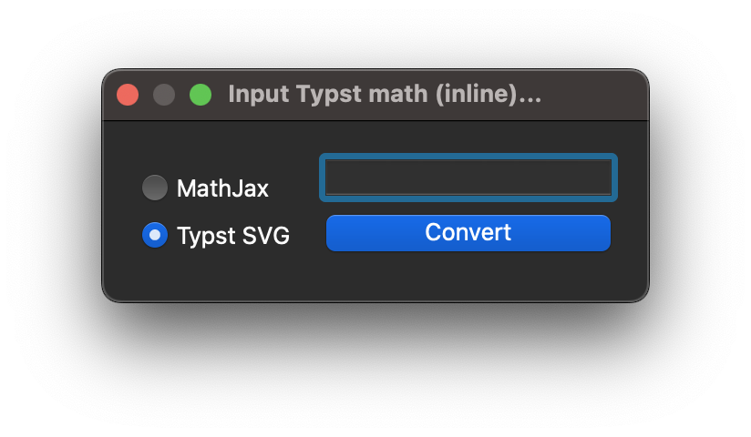
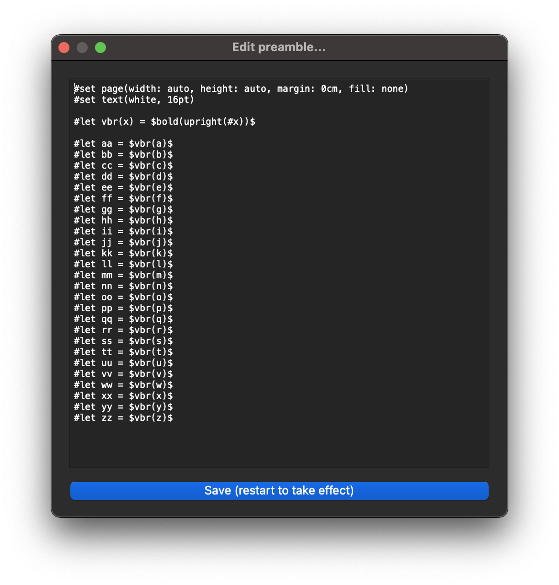
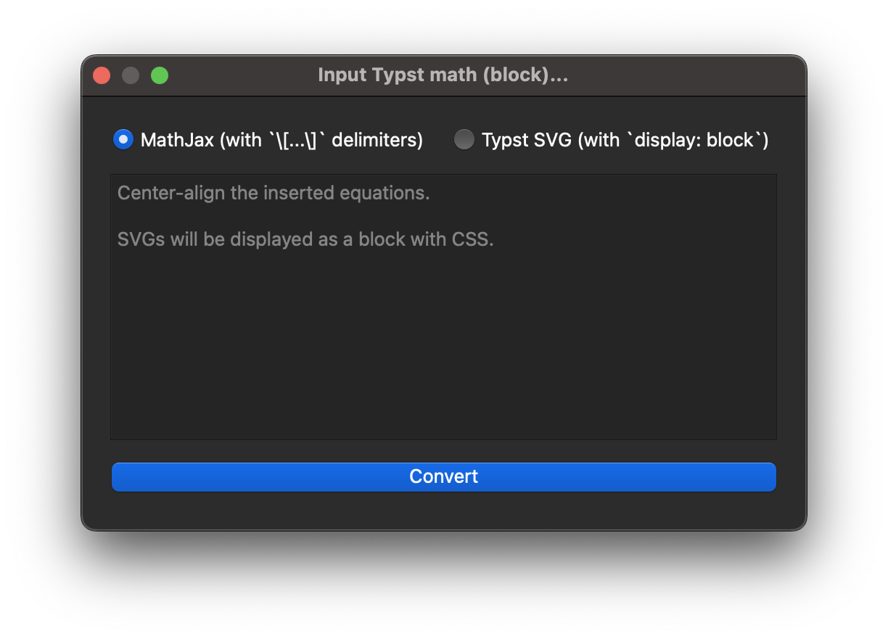

# typst-anki

Convert `typst` math code to `MathJax` (via pandoc) or `SVG`s (via the typst compiler) for use in Anki flashcards. Click either the `Typst math inline` button or press <kbd>Ctrl + M, T</kbd> for the inline math editor (<kbd>Ctrl+M, B</kbd> for the math block editor). 

Alternatively, click `Typst math replace` or press <kbd>Ctrl + M, R</kbd> to replace all instances of typst math code between `$...$` with rendered equations. Add custom functions inside [`preamble.typ`](src/typst-anki/user_files/preamble.typ)—make sure to change your text color according to your system theme!

<p align="center">
    
    
    
</p>

> [!IMPORTANT]  
> On MacOS, make sure `pandoc` is available under `/usr/local/bin/pandoc` otherwise Anki cannot find it.

## Installation

```sh
git clone git@github.com:xkevio/typst-anki.git
cd typst-anki/src/typst-anki

mkdir lib # <- this stores external dependencies for Anki.
pip install typst -t ./lib/
pip install pypandoc -t ./lib/

zip -r typst-anki.zip ./*
```

Then, open Anki > Tools > Addons > Install from file > `typst_anki.zip`.
(Pandoc needs to be installed on your system and available via `$PATH`.) Or, if you wish, use [`just`](https://github.com/casey/just).

## TODO

- [ ] **Feature:** Use Typst HTML export when it releases (MathML).
