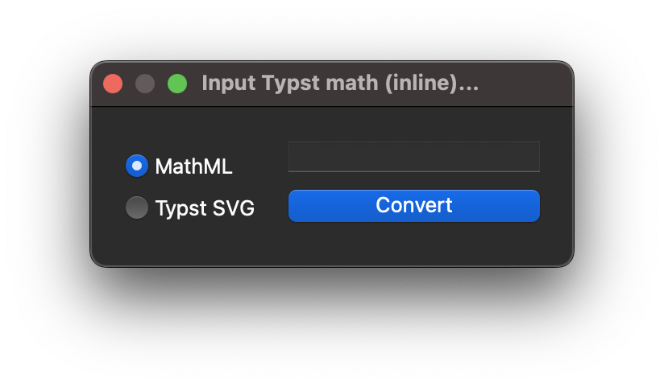
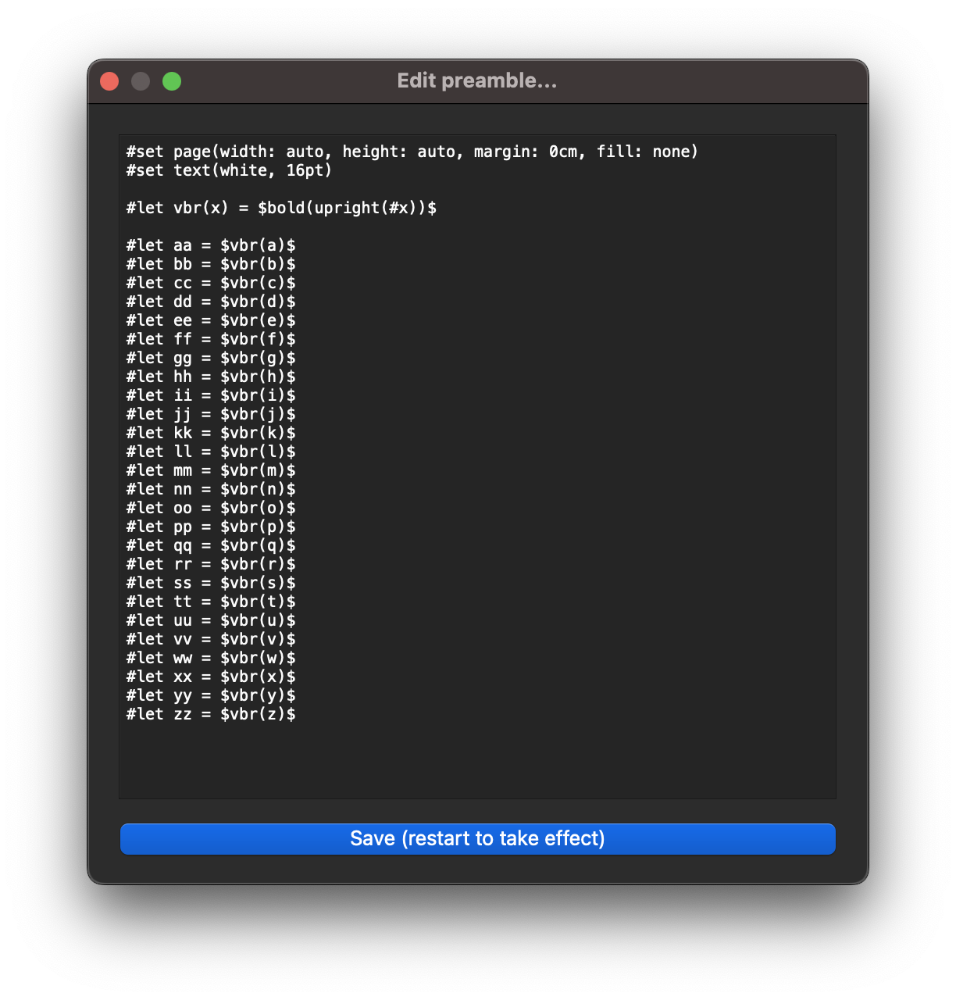
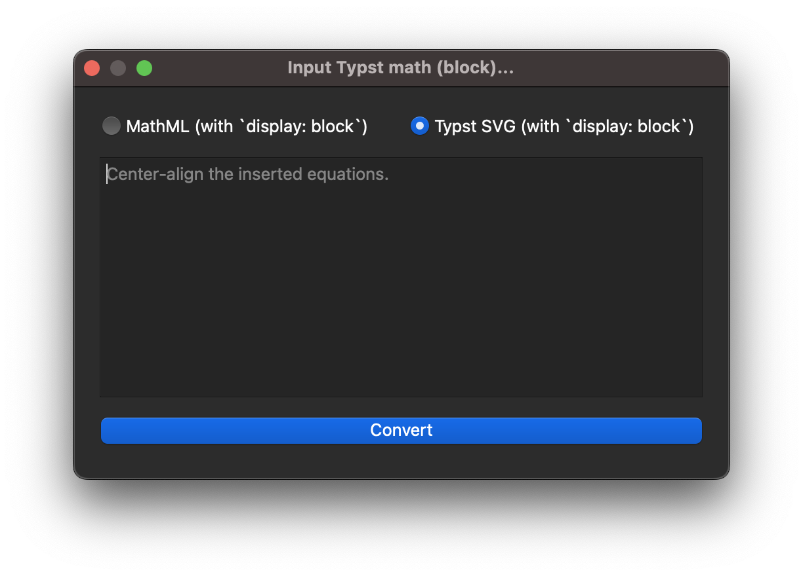

# typst-anki

Convert `Typst` math code to `MathML`or `SVG`s (via the Typst compiler) for use in Anki flashcards. Click either the `Typst math inline` button or press <kbd>Ctrl + M, T</kbd> for the inline math editor (<kbd>Ctrl+M, B</kbd> for the math block editor). 

Alternatively, click `Typst math replace` or press <kbd>Ctrl + M, R</kbd> to replace all instances of typst math code between `$...$` with rendered equations. Add custom functions inside [`preamble.typ`](src/typst-anki/user_files/preamble.typ)—make sure to change your text color according to your system theme!

<p align="center">
    
    
    
</p>

## Installation

```sh
git clone git@github.com:xkevio/typst-anki.git
cd typst-anki/src/typst-anki

mkdir lib # <- this stores external dependencies for Anki.
pip install typst -t ./lib/
zip -r typst-anki.zip ./*
```

Then, open Anki > Tools > Addons > Install from file > `typst_anki.zip`.
Or, if you wish, use [`just`](https://github.com/casey/just).

## Features

- [x] Use Typst HTML export to utilize MathML (since Typst v0.15.0).
- [x] Use Typst SVG export to ensure same visual look everywhere.
